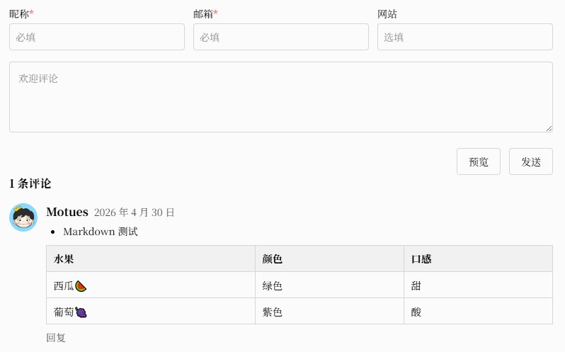
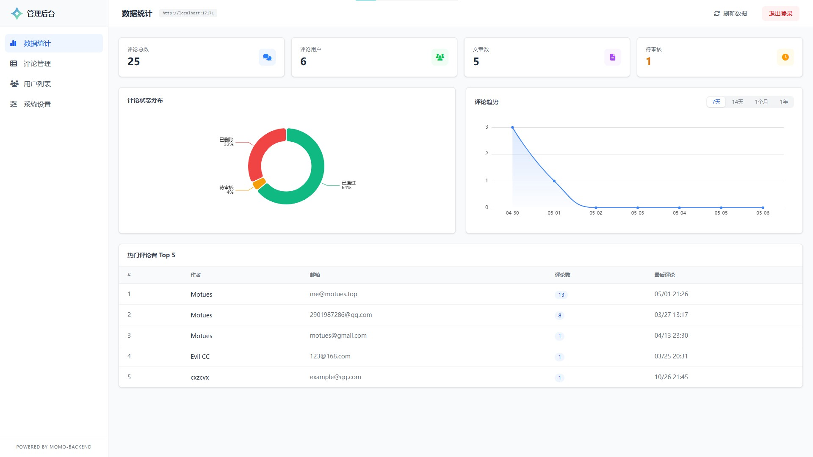

<div align="center">
    
    <h1>Momo Backend</h1>
    <p><strong>轻量，便捷，易部署的博客评论系统</strong></p>
    <p>
        =22-green" alt="Node">
        
        
        
    </p>
    <p>
        
        
        
        
        
        
    </p>
</div>

<!--  -->


## 主要功能

- 💬 **多级嵌套评论** — 支持无限层级的树形回复，Markdown 编辑，自动渲染 HTML
- 🛡️ **安全防护** — IP 封禁、黑名单（IP/邮箱）、XSS 过滤、评论频率限制、管理员评论密钥验证，邮箱认证
- 📧 **邮件通知** — SMTP 配置，新评论及回复自动通知，支持自定义模板
- 📊 **管理面板** — 评论审核、数据概览统计、用户管理、模块化系统设置
- ⚡ **多后端支持** — Node.js 、Go 、Cloudflare Worker 三种实现
- 🔄 **数据管理** — JSON 格式导入/导出，方便备份迁移
- 🎨 **前端组件** — Svelte 5 构建的轻量评论组件，支持 CDN 引入和自定义占位符
- 🗄️ **SQLite 存储** — 零配置数据库，无需额外安装数据库服务


## 快速开始

Momo Backend 包含前端和后端两个模块，需要分别进行部署。

### 前端部署

前端即为评论页面，一般集成在博客、论坛等位置，用于提交并展示评论，使用 Svelte 5 开发。

前端可以通过 CDN 引入，也可以自行修改编译成 JS 文件，集成到自己的项目中。具体部署方式参考 [frontend](./frontend/README.md)。

如果需要自己设计前端样式，或集成到已有的评论组件中，可参考 [API 文档](./doc/api.md) 自行开发。

### 后端部署

后端用于提供评论存储和管理服务，包括 API 应用和管理面板。

#### API 应用

API 应用基于 SQLite 数据库，对外提供 RESTful API，目前提供四种部署方式：

* **Docker 版本** — 一键部署，推荐方式
* **Node.js 版本** — 基于 Hono 4 + Drizzle ORM，适合有 Node.js 环境的服务器
* **Go 版本** — 编译为单二进制文件，部署简单性能优异
* **Cloudflare Worker 版本** — 基于 Hono + D1 + KV，无需服务器

> 如需其他平台的部署支持，欢迎提交 Issue。

具体部署方式请参考对应文档：[Docker](#docker-部署) · [Node.js](./nodejs/README.md) · [Go](./go/README.md) · [Cloudflare Worker](./worker/README.md)

#### Docker 部署

Go 版本支持 Docker 一键部署，镜像发布在 GitHub Container Registry。

```bash
# 使用 docker-compose（推荐）
curl -fsSLO https://raw.githubusercontent.com/Motues/Momo-backend/main/docker-compose.yml
docker compose up -d

# 或直接运行
docker run -d \
  --name momo-backend \
  -p 3000:3000 \
  -v momo-data:/app/data \
  ghcr.io/motues/momo-backend:latest
```

启动后访问 `http://localhost:3000`，默认管理员账号密码均为 `momo`。

#### 管理面板

提供可视化面板对评论数据进行管理，基于 Vue 3 构建。

[Release](https://github.com/Motues/Momo-Backend/releases) 中默认已集成编译好的静态文件（`./public` 目录），部署后可直接访问 `/admin` 路径打开管理面板。

源码位于 `./dashboard` 目录，可自行修改页面样式和功能，修改后执行 `pnpm build` 重新编译。

## 版本更新

项目仍处于维护状态，不定期更新。更新前请参考[更新文档](./doc/update.md)。

## 界面展示

<details>
<summary>点击查看界面预览</summary>

<div align="center">
    
    <p>前端评论页面展示</p>
</div>

<div align="center">
    
    <p>管理后台登录界面</p>
</div>

<div align="center">
    
    <p>管理后台首页</p>
</div>

</details>

## 相关文档

* [API 文档](./doc/api.md) — 完整的接口定义和调用示例
* [数据库表结构](./doc/data_table.md) — 数据表字段说明
* [更新文档](./doc/update.md) — 版本升级指南
* [Momo 静态博客](https://github.com/Motues/Momo) — 配套博客主题

## 开发计划

- [ ] 支持其他评论系统的数据迁移（Twikoo、Valine 等）

> 欢迎提交 Issue 和 PR，共同完善项目。  
> Made with ❤️ by [Motues](https://wwww.motues.top)
