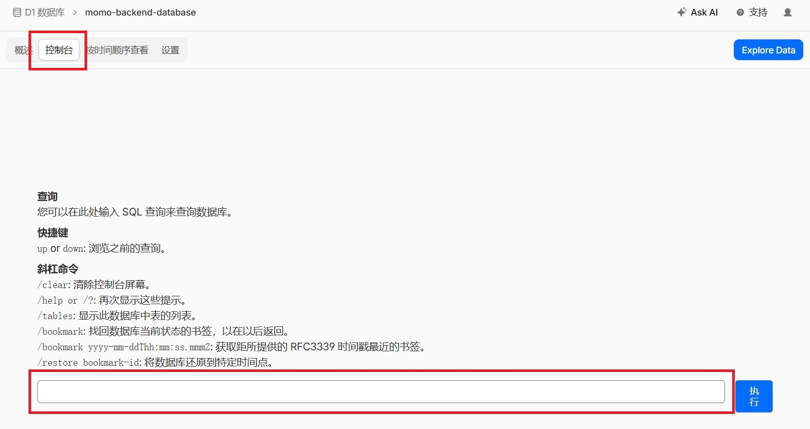

# 更新指南

除非有特殊说明，项目升级升级不对数据库文件进行破坏性修改，数据库可以继续使用。

数据库变化情况可以查看 [数据库更新记录](#数据库更新记录)

## 不同版本升级方式

### Node.js

从 [Relase](https://github.com/Motues/Momo/releases) 下载最新代码，替换原有代码即可，数据库文件无需修改。

**需要更新的文件**包括 `package.json`、`pnpm-lock.yml`、`src`、 `prisma` 和 `public` 文件夹下的所有文件。

升级完成后，请执行 `pnpm install` 安装依赖包。

```bash
pnpm install
pnpm build
pnpm start
```

### Go

从 [Relase](https://github.com/Motues/Momo/releases) 下载最新二进制文件，替换原有二进制即可，数据库文件无需修改。

### Worker

正常情况从 [Relase](https://github.com/Motues/Momo/releases) 下载最新代码，替换原有代码即可。

**需要升级的文件**包括 `package.json`、`pnpm-lock.yml`、`src` 、 `schemas` 和 `public` 文件夹下的所有文件。

升级完成后运行下面的命令推送到 Worker

```bash
pnpm wrangler login
pnpm run deploy
```

如果升级后发现问题，请检查数据库是否添加了新的表。如果添加，请前往 Cloudflare Worker 的 D1 数据库控制台，执行新添加的 SQL 语句。SQL 语句在 `worker/schemas/comment.sql` 文件中。



## 数据库更新记录

### `v1.3.0` 版本

添加了 `Settings` 表，SQL 语句如下：

```sql
CREATE TABLE IF NOT EXISTS Settings (
    key TEXT PRIMARY KEY,
    value TEXT NOT NULL,
    updated_at TEXT DEFAULT (datetime('now'))
);
```

### `v1.4.0` 版本

#### Node.js 重构

Node.js 后端从 **Koa + Prisma** 迁移至 **Hono + Drizzle ORM**。

Prisma 下 model `Setting`（单数）对应表名 `Setting`，为了与其他版本保持一致，本次重构将表名称改成 `Settings`。

Node.js 版本更新前需要运行迁移脚本，请执行下面的命令

```bash
node scripts/migrate-settings-table.js
```

#### 新增邮箱认证功能

添加了 `EmailVerification` 表，SQL 语句如下：

```sql
CREATE TABLE IF NOT EXISTS EmailVerification (
    id INTEGER PRIMARY KEY AUTOINCREMENT,
    email TEXT NOT NULL,
    token TEXT NOT NULL UNIQUE,
    expires_at TEXT NOT NULL,
    verified INTEGER NOT NULL DEFAULT 0,
    post_slug TEXT,
    post_title TEXT,
    created_at TEXT NOT NULL DEFAULT (datetime('now')),
    verified_at TEXT
);
CREATE INDEX IF NOT EXISTS idx_ev_email ON EmailVerification(email);
CREATE INDEX IF NOT EXISTS idx_ev_token ON EmailVerification(token);
```